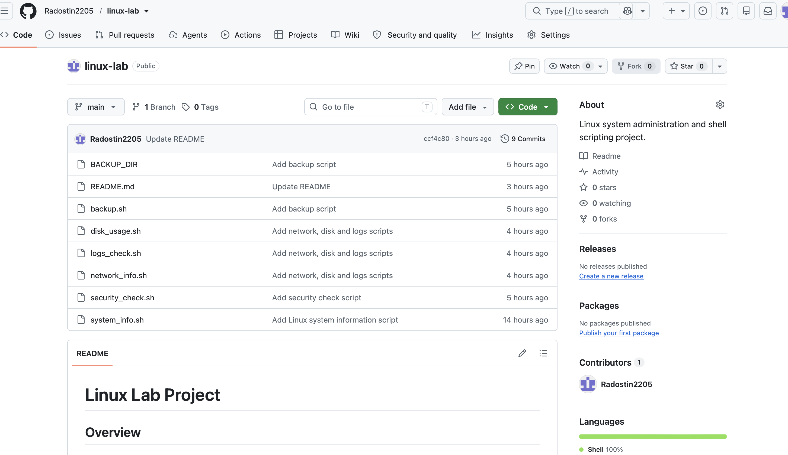
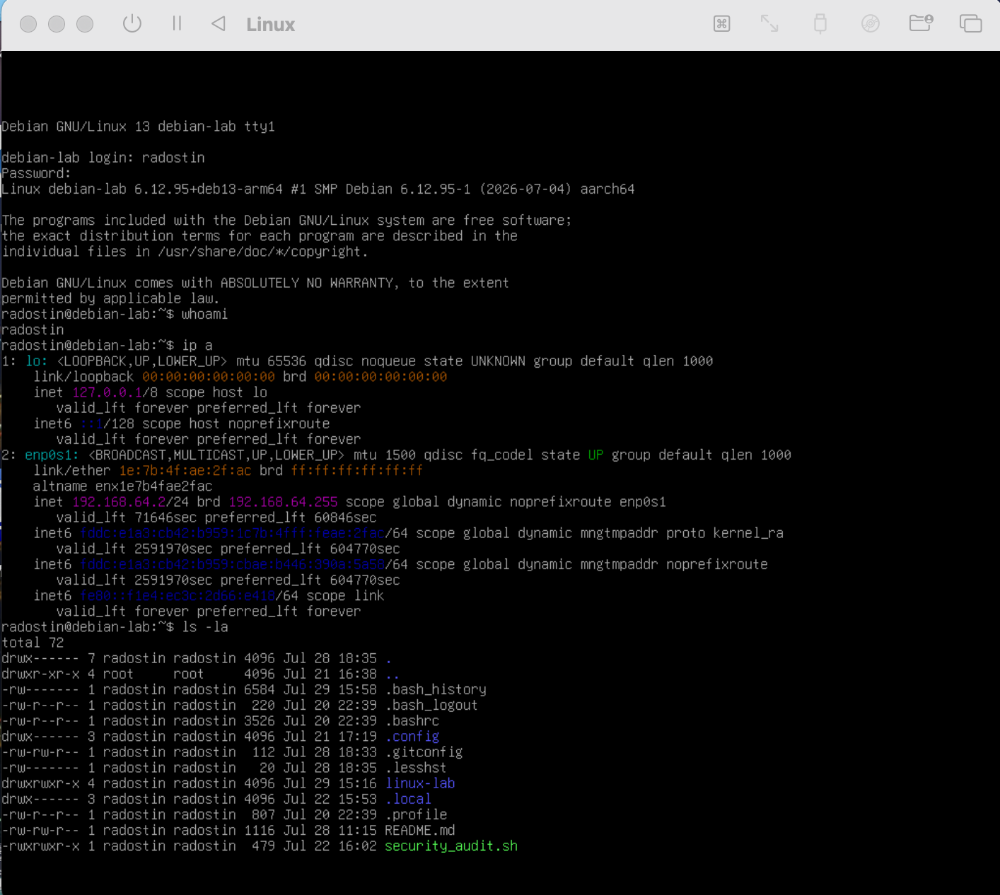
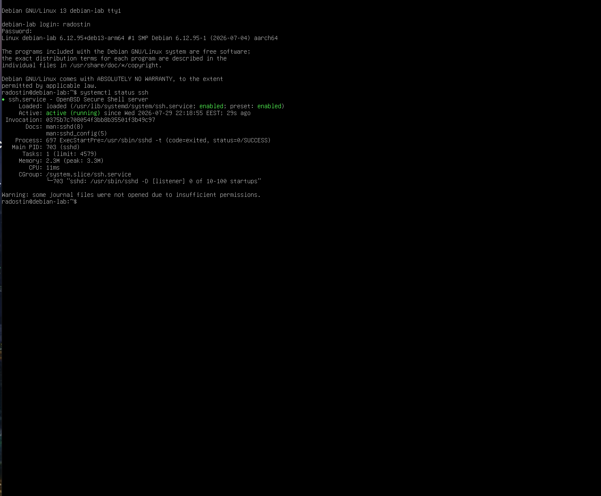
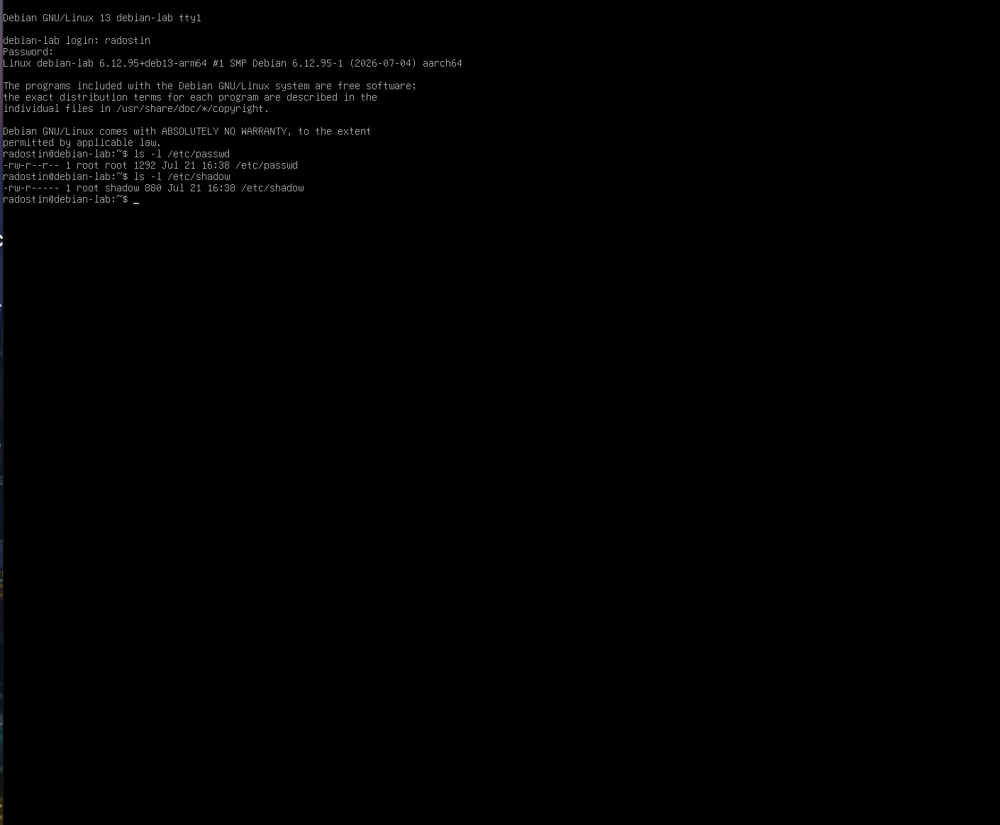

# Linux Lab Project

## Overview
A Linux system administration and Bash scripting practise project created to improve skills in Linux commands, system monitoring, automation, and Git version control.

## Technologies 
- Debian Linux
- Bash scripting
- Git & GitHub

## Features

### System Information
'system_info.sh'
- Displays hostname
- Shows kernel version
- Provides CPU and memory information
- Shows disk usage

### Security Check
'security_check.sh'
- Lists system users
- Shows open ports
- Displays recent login activity
- Cheks file permissions

### Backup Tool
'backup.sh'
- Creates a backup directory
- Copies important project files

### Network Information
'network_info.sh'
- Shows IP addresses
- Displays network interfaces
- Shows routing information

### Disk Monitoring
'disk_usage.sh'
- Displays disk space usage
- Shows directory sizes

### Log Monitoring 
'logs_check.sh'
- Displays recent system logs

## Installation

Clone the repository:

'''bash
git clone https://github.com/Radostin2205/linux-lab.git
'''

## Scripts

- `system_info.sh` - Displays system information
- `network_info.sh` - Shows network configuration
- `disk_usage.sh` - Checks disk usage
- `logs_check.sh` - Analyzes system logs
- `security_check.sh` - Performs basic security checks
- `backup.sh` - Creates backups

## Project Screenshots

### Project Overview

### Linux Security

### SSH Service

### File Permissions

